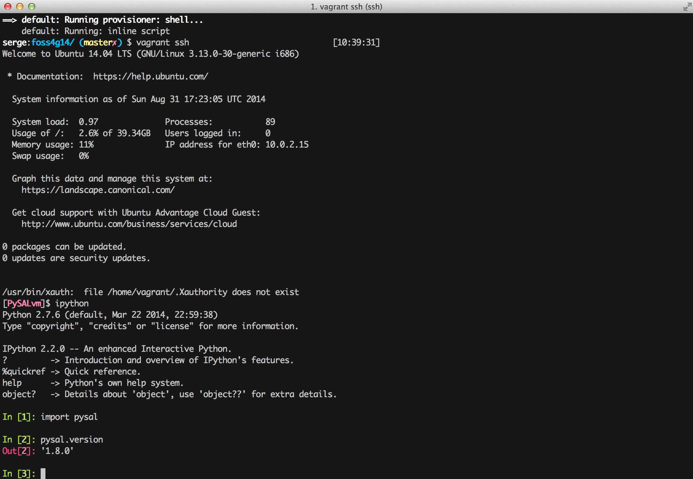

# Exploratory Spatial Data Analysis with PySAL

**Sergio Rey**

**September 8, 2014**

**FOSS4G  2014, Portland, OR**

## Workshop Description

PySAL is a cross-platform library of spatial analysis functions written in Python. It is intended to support the development of high level applications for spatial analysis with an emphasis on vector spatial data. This tutorial will provide hands-on training in a select set of PySAL modules with a particular focus on spatial data processing, spatial autocorrelation analysis and visualization.

## Prerequisites

- Previous experience with Python programming is recommended
- Participants should bring their own laptops to the workshop
- Software should be installed prior to traveling to the workshop (instructions below)

### Software Requirements

There are a number of ways to install PySAL, and below we list three common approaches. The first two
utilize python distributions that have the advantage of including the dependencies for PySAL as well as PySAL. These
distributions install natively on your operating system so you have to take care not to confuse them with any other Python installs you may already have on your machine.

The third alternative uses VirtualBox and Vagrant to create a virtual machine that contains all the required dependencies for PySAL. The advantage of this approach is that the vm is isolated from your host operating system so there should be less confusion in the case where you already have one or more Python distributions on your machine.

#### PySAL via Anaconda Python Distribution

1. Install [Anaconda Python Distribution Version 1.8.0][Anaconda]
2. Open a terminal/shell/Powershell
2. `pip install -U pysal`

#### Enthought Canopy
Note that the Academic version of Canopy comes with PySAL version 1.7. For this workshop we will be using PySAL 1.8. Upgrading in Canopy can be done as follows:

1. Install [Canopy][Canopy]
2. Run Canopy
3. From the menu select `Tools Canopy Terminal`
4. `pip install -U pysal`

#### Vagrant and a Virtual Machine

1. Download the installer for [VirtualBox] for your operating system. For **Windows** download [VirtualBox 4.3.12] as the most recent version has some subtle bugs that break Vagrant.
1. Run the VirtualBox installer
2. Download the installer for [Vagrant] for your operating system
1. Run the Vagrant installer
5. For users on **Windows** download [git bash](http://msysgit.github.io/)
3. In a terminal (or git-bash for **Windows**), create a working directory. This is where your virtual machine will be run from
4. Download the file [Vagrantfile] and place it in this directory
6. `vagrant up`    Note that this step will build your virtual machine, so it will take some time (20-30 minutes). This is a one-time cost, so once the machine is provisioned, we only need to boot it to use it (and booting should take 20 or so seconds).
7. Once the machine is built and running, you connect to it with: `vagrant ssh` . At that point you should be at the bash prompt and ready to go.
8. At the prompt, enter `ipython` then use the `Enter` key
9. Enter `import pysal` then the `Enter` key

You should see something like the following:

	

## Outline

- Part  1: Introduction and Setup (30 minutes)
	- PySAL Overview
	- Software Configuration Checks
	- IPython Notebook
- Part  2: PySAL for Spatial Data Processing (60 minutes)
	- Spatial Data Processing with PySAL
	- Spatial Weights
	- Visualization
- Break (15 Minutes)
- Part  3: PySAL for Exploratory Spatial Data Analysis (75 Minutes)
	- Global Spatial Autocorrelation Analysis
	- Local Spatial Autocorrelation Analysis

[PySAL]: http://pysal.org
[GeoDaSpace]: https://geodacenter.asu.edu/geodaspace-mode
[Anaconda]: http://continuum.io/downloads.html
[Canopy]: https://www.enthought.com/store
[VirtualBox]: https://www.virtualbox.org/wiki/Downloads
[VirtualBox 4.3.12]: http://download.virtualbox.org/virtualbox/4.3.12/VirtualBox-4.3.12-93733-Win.exe
[Vagrant]: http://www.vagrantup.com/downloads.html
[Vagrantfile]: Vagrantfile
